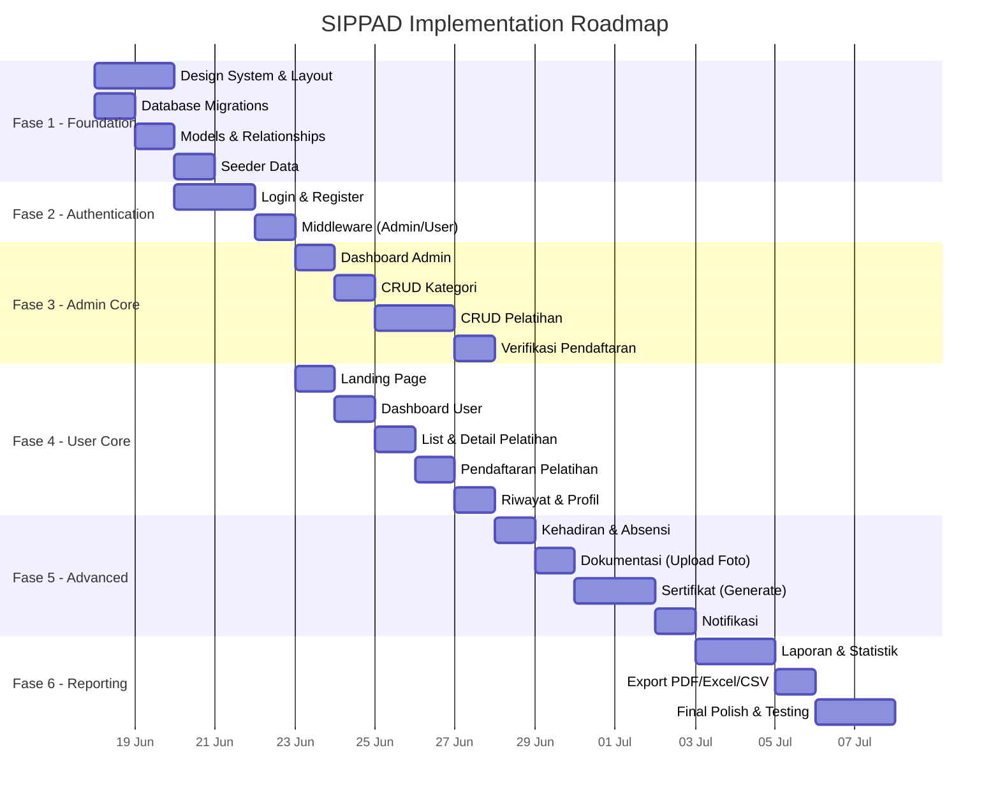

# 📋 SIPPAD — Implementation Planning

> **Project:** Sistem Pendaftaran Pelatihan Anak Desa  
> **Stack:** Laravel 13 · Blade · Vite · TailwindCSS v4 · SQLite  
> **Design System:** Adobe-inspired (adobe.md)  
> **Author:** Prof. Dr. Meki  
> **Date:** 17 Juni 2026

---

## Daftar Isi

1. [Analisis Ambiguitas Arsitektur](#1-analisis-ambiguitas-arsitektur)
2. [Resolusi & Keputusan Desain](#2-resolusi--keputusan-desain)
3. [Design System (Adobe Template)](#3-design-system-adobe-template)
4. [Arsitektur Final](#4-arsitektur-final)
5. [Roadmap Implementasi](#5-roadmap-implementasi)
6. [Detail Per Fase](#6-detail-per-fase)

---

## 1. Analisis Ambiguitas Arsitektur

Setelah menganalisis 6 file di folder `docs/architecture/`, saya menemukan **11 ambiguitas** yang perlu diklarifikasi sebelum implementasi.

### 🔴 Ambiguitas Kritis (Harus Diselesaikan)

| # | Sumber Konflik | Detail | File Terkait |
|---|---|---|---|
| **A1** | **Tabel User vs Admin terpisah vs satu tabel `users`** | ERD mendefinisikan entitas `User` dan `Admin` sebagai **2 tabel terpisah** (`users` + `admins`). Namun Laravel default hanya punya 1 model `User`. Arsitektur MVC juga menyebut `AuthController` tunggal. | ERD, Rancangan Arsitektur |
| **A2** | **DBMS: MySQL/PostgreSQL vs SQLite** | Rancangan Arsitektur menyebut "MySQL atau PostgreSQL", tetapi project saat ini menggunakan **SQLite** (`database/database.sqlite`). | Rancangan Arsitektur vs aktual |
| **A3** | **Frontend: Bootstrap/Tailwind vs Adobe Design** | Rancangan Arsitektur menyebut "Bootstrap / Tailwind CSS". Project saat ini sudah install **TailwindCSS v4**. Design template menggunakan **Adobe Spectrum** style. Harus dipilih satu pendekatan. | Rancangan Arsitektur, adobe.md, package.json |
| **A4** | **Proses 7.0 (Generate Laporan) tidak punya DFD Level 2** | Ringkasan DFD menyebut 7 proses (1.0–7.0), tetapi DFD Level 2 hanya tersedia untuk proses 1.0–6.0. Proses **7.0 Generate Laporan** tidak dijabarkan. | DFD |

### 🟡 Ambiguitas Moderat (Perlu Kejelasan)

| # | Sumber Konflik | Detail | File Terkait |
|---|---|---|---|
| **A5** | **Data Store D6 & D7 tidak muncul di DFD Level 1** | Data Store mencantumkan D6 (Dokumentasi) dan D7 (Kategori), tapi keduanya **tidak muncul** di diagram DFD Level 1. | DFD |
| **A6** | **Sertifikat: Opsional atau Wajib?** | ERD menandai Sertifikat sebagai "(Opsional)". Tapi Flowchart & Workflow menggambarkannya sebagai bagian alur utama (auto-generate jika hadir). | ERD vs Flowchart vs Workflow |
| **A7** | **Notifikasi: Hanya saat ditolak atau juga saat disetujui?** | Workflow Admin: notifikasi hanya dikirim saat **ditolak**. Workflow User & Flowchart: notifikasi dikirim **baik disetujui maupun ditolak**. | Workflow vs Flowchart |
| **A8** | **Kuota management tidak ada di DFD/Flowchart** | Workflow Admin menjelaskan pengelolaan kuota (auto-close saat penuh), tapi fitur ini **tidak muncul** di DFD maupun Flowchart. | Workflow vs DFD/Flowchart |
| **A9** | **Atribut User: tanggal_lahir & umur** | ERD User tidak punya `tanggal_lahir`. Workflow User menyebut "Tanggal Lahir (opsional)". Workflow Admin verifikasi menampilkan "Umur" (bukan tanggal lahir). | ERD vs Workflow |

### 🟢 Ambiguitas Minor (Inkonsistensi Penamaan)

| # | Detail |
|---|---|
| **A10** | Login field: DFD menyebut "Email & Password", Workflow Admin menyebut "email/username dan password", ERD Admin punya "username" bukan "email". |
| **A11** | Flowmap Level 0 (Context Diagram) **duplikat** dengan DFD Level 0 — konten identik dengan format berbeda. |

---

## 2. Resolusi & Keputusan Desain

> [!IMPORTANT]
> Keputusan berikut menjadi **acuan final** untuk implementasi. Tuan Baji dipersilakan memberikan feedback jika ada yang perlu diubah.

| # | Ambiguitas | ✅ Resolusi |
|---|---|---|
| **A1** | User vs Admin terpisah | **Satu tabel `users` dengan kolom `role`** (`admin` / `user`). Ini standar Laravel, lebih simpel, dan satu `AuthController` cukup. |
| **A2** | DBMS | **Tetap SQLite** untuk development. Bisa migrasikan ke MySQL/PostgreSQL saat production. Laravel migration agnostic. |
| **A3** | Frontend stack | **TailwindCSS v4** (sudah terinstall) + **custom CSS variables** yang mengikuti token Adobe. Tidak perlu Bootstrap. |
| **A4** | DFD Level 2 Laporan | Tambahkan proses: Filter → Query Data → Format Output → Export (PDF/Excel/CSV). |
| **A5** | D6 & D7 missing | Integrasikan ke DFD Level 1 sebagai data store tambahan. Untuk implementasi, buat migration & model-nya. |
| **A6** | Sertifikat | **Implementasikan sebagai fitur opsional** yang bisa di-toggle admin per pelatihan. Default: aktif. |
| **A7** | Notifikasi | **Kirim notifikasi untuk keduanya** (disetujui dan ditolak). Gunakan Laravel Notification (database channel). |
| **A8** | Kuota management | **Implementasikan auto-close**. Saat jumlah peserta disetujui = kuota → status pelatihan otomatis "Closed". |
| **A9** | Tanggal lahir | Tambahkan `tanggal_lahir` (nullable) di tabel users. `umur` dihitung dinamis via accessor. |
| **A10** | Login field | **Email + Password** untuk semua role. Konsisten dan standar Laravel. |
| **A11** | Duplikat Flowmap/DFD | Tidak masalah untuk dokumentasi. Untuk implementasi, ikuti DFD sebagai acuan utama. |

---

## 3. Design System (Adobe Template)

Berdasarkan `docs/design/adobe.md`, berikut mapping design token ke implementasi:

### Color Palette (Light Marketing Mode)

```css
:root {
  /* Brand */
  --color-primary: #FA0F00;         /* Adobe Red — hanya untuk CTA, brand accent */
  --color-primary-hover: #E00D00;
  --color-on-primary: #ffffff;

  /* Surfaces */
  --color-canvas: #ffffff;
  --color-surface-1: #F5F5F5;
  --color-surface-2: #E8E8E8;
  --color-border: #D3D3D3;

  /* Text */
  --color-ink: #1B1B1B;
  --color-ink-muted: #6E6E6E;

  /* Functional */
  --color-link: #0265DC;
  --color-success: #008000;

  /* Spacing */
  --space-base: 8px;

  /* Radius */
  --radius-sm: 2px;
  --radius-md: 4px;
  --radius-lg: 8px;
  --radius-pill: 9999px;

  /* Shadows */
  --shadow-card: 0 1px 4px rgba(0,0,0,0.12);
  --shadow-elevated: 0 4px 16px rgba(0,0,0,0.15);

  /* Motion */
  --duration-fast: 130ms;
  --duration-base: 250ms;
  --easing: cubic-bezier(0.45, 0, 0.40, 1);
}
```

### Typography

| Level | Font | Size | Weight | Line Height |
|---|---|---|---|---|
| Display | Source Sans Pro, sans-serif | 52px | 700 | 1.1 |
| H1 | Source Sans Pro, sans-serif | 36px | 700 | 1.2 |
| H2 | Source Sans Pro, sans-serif | 28px | 600 | 1.3 |
| Body | Source Sans Pro, sans-serif | 16px | 400 | 1.6 |
| Small | Source Sans Pro, sans-serif | 14px | 400 | 1.5 |

> [!NOTE]
> Adobe Clean tidak tersedia publik. Gunakan **Source Sans Pro** (open-source, dibuat Adobe) dari Google Fonts sebagai pengganti.

### Accessibility Rules
- ⚠️ Merah `#FA0F00` **hanya untuk teks besar (18px+)** atau button — gagal AA untuk teks kecil
- ✅ Touch target minimum **44×44px**
- ✅ Focus indicator: `#0265DC`, 2px outline, 2px offset
- ✅ Hormati `prefers-reduced-motion`

---

## 4. Arsitektur Final

### Database Schema (Resolved)

```
users
├── id (PK, auto)
├── nama
├── email (unique)
├── password
├── no_hp (nullable)
├── alamat (nullable)
├── tanggal_lahir (nullable)
├── role (enum: admin, user) [DEFAULT: user]
├── timestamps

kategori_pelatihan
├── id (PK)
├── nama_kategori
├── deskripsi (nullable)
├── timestamps

pelatihan
├── id (PK)
├── kategori_id (FK → kategori_pelatihan)
├── judul
├── deskripsi
├── narasumber
├── lokasi
├── tanggal (date)
├── jam (time)
├── kuota (integer, nullable)
├── persyaratan (text, nullable)
├── status (enum: draft, publish, closed, selesai)
├── sertifikat_enabled (boolean, default true)
├── timestamps

pendaftaran
├── id (PK)
├── user_id (FK → users)
├── pelatihan_id (FK → pelatihan)
├── tanggal_daftar (date)
├── status (enum: pending, disetujui, ditolak)
├── timestamps
├── UNIQUE(user_id, pelatihan_id)

kehadiran
├── id (PK)
├── pendaftaran_id (FK → pendaftaran, unique)
├── status_kehadiran (enum: hadir, tidak_hadir)
├── timestamps

sertifikat
├── id (PK)
├── kehadiran_id (FK → kehadiran, unique)
├── nomor_sertifikat (unique)
├── tanggal_terbit (date)
├── timestamps

dokumentasi
├── id (PK)
├── pelatihan_id (FK → pelatihan)
├── foto_kegiatan (string, file path)
├── timestamps
```

### MVC Structure

```
app/
├── Http/
│   ├── Controllers/
│   │   ├── Auth/
│   │   │   ├── LoginController.php
│   │   │   └── RegisterController.php
│   │   ├── Admin/
│   │   │   ├── DashboardController.php
│   │   │   ├── PelatihanController.php
│   │   │   ├── KategoriController.php
│   │   │   ├── PendaftaranController.php
│   │   │   ├── KehadiranController.php
│   │   │   ├── DokumentasiController.php
│   │   │   ├── SertifikatController.php
│   │   │   └── LaporanController.php
│   │   └── User/
│   │       ├── DashboardController.php
│   │       ├── PelatihanController.php
│   │       ├── PendaftaranController.php
│   │       ├── RiwayatController.php
│   │       └── ProfilController.php
│   └── Middleware/
│       ├── AdminMiddleware.php
│       └── UserMiddleware.php
├── Models/
│   ├── User.php
│   ├── KategoriPelatihan.php
│   ├── Pelatihan.php
│   ├── Pendaftaran.php
│   ├── Kehadiran.php
│   ├── Sertifikat.php
│   └── Dokumentasi.php
├── Notifications/
│   └── PendaftaranStatusNotification.php
└── Services/
    ├── PendaftaranService.php
    ├── SertifikatService.php
    └── LaporanService.php

resources/views/
├── layouts/
│   ├── app.blade.php          (layout utama)
│   ├── admin.blade.php        (layout admin)
│   └── guest.blade.php        (layout auth)
├── components/
│   ├── navbar.blade.php
│   ├── sidebar.blade.php
│   ├── card.blade.php
│   ├── badge.blade.php
│   ├── button.blade.php
│   └── modal.blade.php
├── auth/
│   ├── login.blade.php
│   └── register.blade.php
├── admin/
│   ├── dashboard.blade.php
│   ├── pelatihan/
│   ├── kategori/
│   ├── pendaftaran/
│   ├── kehadiran/
│   ├── dokumentasi/
│   ├── sertifikat/
│   └── laporan/
├── user/
│   ├── dashboard.blade.php
│   ├── pelatihan/
│   ├── pendaftaran/
│   ├── riwayat/
│   └── profil/
└── landing.blade.php
```

---

## 5. Roadmap Implementasi



---

## 6. Detail Per Fase

### Fase 1 — Foundation (3 hari)

**Tujuan:** Setup design system, database, dan models.

#### Tasks:

- [ ] **1.1** Setup CSS variables berdasarkan Adobe token di `resources/css/app.css`
- [ ] **1.2** Import Google Font: Source Sans Pro
- [ ] **1.3** Buat layout utama: `app.blade.php`, `admin.blade.php`, `guest.blade.php`
- [ ] **1.4** Buat Blade components: navbar, sidebar, card, badge, button, modal
- [ ] **1.5** Buat 7 migration files (users update, kategori, pelatihan, pendaftaran, kehadiran, sertifikat, dokumentasi)
- [ ] **1.6** Buat 7 Eloquent models dengan relationships
- [ ] **1.7** Buat seeder: AdminSeeder, KategoriSeeder, PelatihanSeeder (data dummy)

**Deliverable:** Layout system berfungsi, `php artisan migrate:fresh --seed` berhasil.

---

### Fase 2 — Authentication (3 hari)

**Tujuan:** Login, register, role-based middleware.

#### Tasks:

- [ ] **2.1** Halaman Register (user) — form: nama, email, password, no_hp, alamat
- [ ] **2.2** Halaman Login — form: email, password (untuk admin & user)
- [ ] **2.3** `AdminMiddleware` — cek `role === 'admin'`
- [ ] **2.4** `UserMiddleware` — cek `role === 'user'`
- [ ] **2.5** Route group: `/admin/*` (admin only), `/user/*` (user only)
- [ ] **2.6** Redirect logic: admin → admin dashboard, user → user dashboard

**Deliverable:** Login/register berfungsi, role-based access control aktif.

---

### Fase 3 — Admin Core (5 hari)

**Tujuan:** Dashboard admin, CRUD pelatihan & kategori, verifikasi peserta.

#### Tasks:

- [ ] **3.1** Dashboard Admin — statistik: total peserta, pelatihan aktif/selesai, pendaftar, menunggu verifikasi
- [ ] **3.2** CRUD Kategori Pelatihan (index, create, store, edit, update, destroy)
- [ ] **3.3** CRUD Pelatihan (index, create, store, edit, update, destroy)
- [ ] **3.4** Publish/Draft/Close toggle pelatihan
- [ ] **3.5** Halaman Verifikasi Pendaftaran — list pendaftar + tombol Setujui/Tolak
- [ ] **3.6** Auto-close pendaftaran saat kuota penuh

**Deliverable:** Admin bisa kelola seluruh data pelatihan dan verifikasi peserta.

---

### Fase 4 — User Core (4 hari)

**Tujuan:** Landing page, dashboard user, pendaftaran pelatihan.

#### Tasks:

- [ ] **4.1** Landing Page — hero section, daftar pelatihan terbaru, CTA register
- [ ] **4.2** Dashboard User — selamat datang, pelatihan aktif, status pendaftaran
- [ ] **4.3** List Pelatihan — filter by kategori, hanya tampil yang "publish"
- [ ] **4.4** Detail Pelatihan — info lengkap + tombol "Daftar"
- [ ] **4.5** Proses Pendaftaran — konfirmasi → simpan → status pending
- [ ] **4.6** Halaman "Pendaftaran Saya" — daftar + status (pending/disetujui/ditolak)
- [ ] **4.7** Riwayat Pelatihan — pelatihan yang sudah selesai diikuti
- [ ] **4.8** Halaman Profil — edit nama, no_hp, alamat, tanggal_lahir

**Deliverable:** User bisa mendaftar pelatihan dan melihat status.

---

### Fase 5 — Advanced Features (5 hari)

**Tujuan:** Kehadiran, dokumentasi, sertifikat, notifikasi.

#### Tasks:

- [ ] **5.1** Halaman Absensi — admin pilih pelatihan → checklist peserta hadir/tidak
- [ ] **5.2** Upload Dokumentasi — admin upload foto kegiatan per pelatihan
- [ ] **5.3** Generate Sertifikat — auto-generate nomor sertifikat untuk peserta hadir
- [ ] **5.4** Download Sertifikat — user download sertifikat (PDF)
- [ ] **5.5** Notifikasi — kirim notifikasi saat status pendaftaran berubah (database channel)
- [ ] **5.6** Bell icon notifikasi di navbar user

**Deliverable:** Fitur kehadiran, dokumentasi, sertifikat, dan notifikasi berfungsi.

---

### Fase 6 — Reporting & Polish (5 hari)

**Tujuan:** Laporan, export, dan final polish.

#### Tasks:

- [ ] **6.1** Dashboard Laporan — total peserta, hadir, tidak hadir per pelatihan
- [ ] **6.2** Filter laporan — by bulan, tahun, kategori pelatihan
- [ ] **6.3** Export PDF (DomPDF / Snappy)
- [ ] **6.4** Export Excel (Laravel Excel / Maatwebsite)
- [ ] **6.5** Export CSV
- [ ] **6.6** Responsive testing — semua halaman di mobile/tablet/desktop
- [ ] **6.7** Accessibility audit — contrast, focus, motion
- [ ] **6.8** Performance optimization — eager loading, caching
- [ ] **6.9** Final UI polish — animasi, transisi, micro-interactions

**Deliverable:** Sistem SIPPAD lengkap, siap demo/production.

---

## Ringkasan Estimasi

| Fase | Durasi | Prioritas |
|---|---|---|
| Fase 1 — Foundation | 3 hari | 🔴 Kritis |
| Fase 2 — Authentication | 3 hari | 🔴 Kritis |
| Fase 3 — Admin Core | 5 hari | 🔴 Kritis |
| Fase 4 — User Core | 4 hari | 🔴 Kritis |
| Fase 5 — Advanced | 5 hari | 🟡 Penting |
| Fase 6 — Reporting | 5 hari | 🟡 Penting |
| **Total** | **~25 hari kerja** | |

> [!TIP]
> Fase 3 dan Fase 4 bisa dikerjakan **paralel** jika ada lebih dari satu developer, mengurangi total waktu menjadi ~20 hari kerja.

---

> [!WARNING]
> **Sebelum mulai implementasi**, pastikan Tuan Baji sudah mereview dan menyetujui resolusi ambiguitas di [Bagian 2](#2-resolusi--keputusan-desain). Perubahan di tengah implementasi akan menyebabkan rework yang signifikan.

---

## 7. Rencana Perombakan UI/UX Homepage (Tampilan Sebelum Login)

Berdasarkan arahan Tuan Baji untuk menerapkan tema desain **Adobe-inspired** dari `docs/design/adobe.md`, berikut adalah rencana detail perbaikan tampilan Homepage sebelum login:

### 🎨 Elemen Visual & Estetika (Adobe Spectrum Style)
- **Typografi**: Menggunakan `Source Sans 3` dengan struktur hierarki ukuran teks (Display: 48px/52px, Heading 1: 36px, Body: 16px) yang proporsional dan memiliki line-height yang lega (1.5 - 1.6).
- **Warna Aksen**: Menggunakan warna merah khas Adobe (`#FA0F00`) eksklusif untuk elemen penarik perhatian utama (primary button, active navigation indicator, brand mark accent), bukan untuk teks kecil demi menjaga accessibility contrast ratio.
- **Warna Latar Belakang & Permukaan**: Menggunakan gradasi halus dari canvas putih (`#ffffff`) ke abu-abu muda (`#F5F5F5` / `#E8E8E8`) dan grid pattern halus untuk kedalaman estetika.
- **Card Design**: Kartu pelatihan dan kategori menggunakan sudut melengkung sedang (`--radius-lg: 8px`), border tipis abu-abu (`#D3D3D3`), bayangan lembut (`shadow-card`), dan efek scaling/elevation transisi hover.

### 🏛️ Penambahan Section & Kelengkapan Informasi
1. **Hero Section (Modern Centered & Glassmorphism Accent)**:
   - Tagline utama yang berani ("Sistem Pendaftaran Pelatihan Anak Desa") menggunakan font Source Sans 3 tebal (700) dengan line-height 1.1.
   - Sub-deskripsi yang informatif.
   - Tombol CTA ganda: "Mulai Belajar" (Primary Red) dan "Jelajahi Pelatihan" (Outline/Secondary).
   - Aksen grid dekoratif di latar belakang.
2. **Stats Section (Dinamis/Statis Ringkasan Data)**:
   - Menampilkan total pelatihan, total peserta, dan sertifikat terbit dengan visualisasi angka tebal dan label ringkas.
3. **Kategori Pelatihan Section (Dinamis)**:
   - Grid kartu kategori pelatihan yang diambil dari database untuk mempermudah navigasi user berdasarkan minat.
4. **Pelatihan Terbaru Section (Dinamis)**:
   - Menampilkan 3 pelatihan berstatus `publish` terbaru secara dinamis.
   - Setiap kartu berisi: kategori, judul, narasumber, tanggal/jam, lokasi, persentase sisa kuota (progress bar), dan tombol "Lihat Detail".
5. **Alur Pendaftaran (How It Works)**:
   - Panduan visual langkah demi langkah menggunakan ikon SVG premium (Daftar Akun -> Pilih Pelatihan -> Ikuti Kelas -> Unduh Sertifikat).
6. **Footer Premium**:
   - Terbagi dalam 3 kolom: Branding & Deskripsi SIPPAD, Link Navigasi Cepat, dan Informasi Kontak / Alamat Desa.

### ⚡ Integrasi Data & Kode (Tanpa Mengubah Logika Bisnis)
- Mengubah route `/` pada `routes/web.php` hanya untuk memuat data kategori dan pelatihan terbaru secara ringkas dari database.
- Memperbarui file `resources/views/landing.blade.php` dengan markup HTML5 semantik dan styling TailwindCSS v4 + CSS variables.
- Membuka halaman di browser untuk audit visual dan responsive testing.

